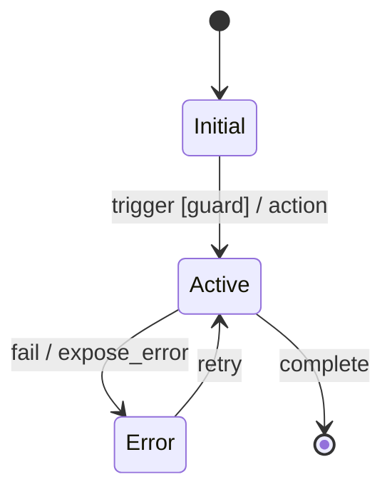

# Decompose Requirements

Decompose requirement text into phased, implementation-ready artifacts for this Rails BFF repository.

## Inputs

- Requirement summary or source path: `${input:requirements_source}`
- Feature slug (kebab-case): `${input:feature_slug}`
- In-scope areas: `${input:scope}`
- Out-of-scope areas: `${input:out_of_scope}`

## Repository context (must follow)

- Stack: Rails 8.1 + Hotwire (Turbo/Stimulus via importmap), not Next.js runtime assumptions.
- Routing: user-facing routes are locale-scoped (`/en`, `/th`).
- Architecture: thin controllers, orchestration in use cases, query objects for reads.
- Contract boundary: Rails owns canonical UI contract; provider differences stay in `app/integrations/backend/*`.
- Authorization: enforce via Pundit policies, not raw role checks in controllers/views.
- i18n: user-facing copy must map to `config/locales/en.yml` and `config/locales/th.yml`.

## Output location

Create or update:

`docs/tasks/<feature>/` where `<feature>` = `${input:feature_slug}`

Required files:

- `00-specifications.md`
- `01-overview.md`
- `test-scenarios.md`
- `phase-01-foundation.md`
- `phase-02-*.md` (and more as needed)

---

## Step 0: Framework translation pass (required when source is Next.js-oriented)

If the source uses frontend/backend terminology from other stacks, create a translation table before decomposition:

| Source term | Rails BFF equivalent |
| --- | --- |
| App Router page | `config/routes.rb` + controller action + ERB view |
| API route (`/api/*`) | Rails controller endpoint under route namespace |
| Server Action | Controller action + form submit + use case orchestration |
| Middleware auth check | `before_action` + Pundit policy enforcement |
| Client hook state | Stimulus controller state / Turbo frame behavior |
| SSR data loader | controller/query object (`app/queries/*`) |

Include this mapping in `00-specifications.md` when used.

---

## Step 1: Pattern matching (quick ambiguity check)

Scan for vague terms and resolve or ask clarifying questions:

- fast/slow, secure/safe, easy/simple, some/many/few, etc/and more, handle/process/manage, automatically

For each vague term, record:

| Vague term | Concrete interpretation |
| --- | --- |

Do not continue with unresolved ambiguous terms.

---

## Step 1.5: Source inventory (required)

Catalog what the source material contains:

```txt
Source: [filename, URL, or inline description]
  Contains:
    [ ] Entity/data model definitions (count: ___)
    [ ] Field-level specs with types/validation (count: ___)
    [ ] Form/UI component specs (count: ___)
    [ ] API endpoint definitions (count: ___)
    [ ] Workflow state transitions (count: ___)
    [ ] Guard conditions + error messages (count: ___)
    [ ] Permission/role definitions (count: ___)
    [ ] Enum/constant definitions (count: ___)
    [ ] Business algorithms/calculation rules (count: ___)
    [ ] Cross-module integration contracts (count: ___)
    [ ] Non-functional requirements (count: ___)
    [ ] ID/number formatting patterns (count: ___)
```

Classify depth:

- Lite: behavior-only, little structural detail
- Standard: behavior + some entities/APIs/permissions
- Full: broad detail across multiple categories

---

## Step 2: State machine (required)

For each feature, define state model first:

```txt
Feature: [Name]

States:
  - Initial:
  - Normal:
  - Error:
  - Final:

Transitions:
  [from] --[trigger]--> [to] : [side effect]
```

Add Mermaid:



For guarded transitions, include:

- Guard condition
- User-facing error message
- Enforcement point (`BFF`, `UI`, or `both`)

---

## Step 2.5: Detail extraction (conditional by inventory depth)

Only extract sections present in source:

1. Entity and field inventory (required validations + ownership)
2. API inventory (request/response shapes + error codes)
3. Permission matrix (permission-to-role mapping + enforcement point)
4. Enum and i18n labels (English/Thai when available)
5. Business algorithms (decision tables + worked examples)
6. Integration contracts (trigger, payload, fallback)
7. NFRs (performance, concurrency, integrity targets)
8. UI composition specs (columns/cards/refresh behavior)

For Rails BFF alignment, annotate each item with implementation home:

- `app/domains/*`
- `app/use_cases/*`
- `app/queries/*`
- `app/integrations/backend/*`
- `app/policies/*`
- `app/controllers/*`
- `app/views/*`

---

## Step 3: Gherkin scenarios (required)

Write scenarios for every meaningful transition:

```gherkin
Feature: [Feature name]
  As a [actor]
  I want [goal]
  So that [benefit]

  Definitions:
    - Term: meaning

  @must
  Scenario: [happy path]
    Given ...
    When ...
    Then ...

  @must
  Scenario: [common error]
    Given ...
    When ...
    Then ...
```

Priority tags:

- `@must`: required for release
- `@should`: important but can follow must-haves
- `@could`: optional
- `@wont`: explicitly excluded

Coverage checklist:

- Happy path
- Validation errors
- Unauthorized/forbidden
- Not found
- Conflict/race condition
- Each error state
- Each state transition
- Locale-sensitive behavior (`/en`, `/th`) where user-facing

---

## Step 4: Test scenario mapping (required)

Generate `test-scenarios.md` mapping Gherkin scenarios to repo test layers:

| Scenario | Priority | Request spec | Policy spec | Contract spec | System spec |
| --- | --- | --- | --- | --- | --- |

Rules:

- `@must`: request + policy always; contract parity when integration affected; critical journey system spec.
- `@should`: request and/or policy required; contract spec when integration is touched.
- `@could`: optional, but record intended coverage.
- Include locale coverage expectations for user-visible scenarios.

---

## Step 4.5: Completeness verification (required for Standard/Full depth)

Build a source traceability matrix:

| Source item | Category | Covered by scenario? | Covered by extraction? | Output location |
| --- | --- | --- | --- | --- |

Do not proceed to decomposition until no uncovered mandatory items remain.

---

## Step 5: Decomposition

Decompose into vertical slices with `@must` first:

1. Phase 1 Foundation: contracts, seams, policy skeletons, route skeletons.
2. Phase 2..N Features: implement `@must`, then `@should`.
3. Final phase: `@could`, hardening, and polish.

Each phase file must be self-contained and include:

- Goal
- Scenarios covered
- Scope (files/directories)
- Implementation detail carried from Step 2.5
- Risk notes and guard conditions
- Tests to add/update in that phase

---

## Required validation plan in output

`01-overview.md` must include the execution order for repository checks:

1. `bin/rubocop`
2. `bin/rspec --exclude-pattern "spec/system/**/*_spec.rb"`
3. `bundle exec i18n-tasks health` (when locale keys changed)
4. `bin/ci` as final gate

If system coverage is required for critical flows, include:

- `bin/rspec spec/system`

