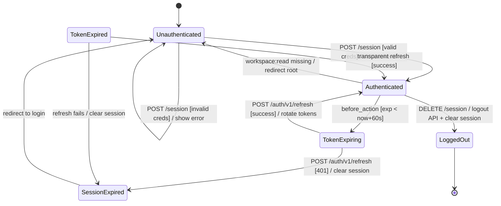

# 00 — Specifications: Authentication Remote API Integration

## Feature slug: `authentication-remote-api`

---

## Framework translation table

| Source/current term | Rails BFF equivalent |
|---|---|
| `email` login param (current BFF) | `username` — real API uses `username` field |
| `/api/v1/auth/login` (current path) | `/auth/v1/login` — real API base URL excludes `/api` prefix |
| Local SessionProvider mock | `Providers::Remote::SessionProvider` wired to real API |
| Token storage (access + refresh) | Rails encrypted cookie session (`Security::SessionStore`) |
| CSRF token (new) | `csrf_token` in `SessionSnapshot` + `SessionStore`; sent as `x-csrf-token` header |
| Token refresh (missing) | `Security::RefreshSession` use case + `Remote::SessionProvider#refresh` |
| Sign-out (no-op today) | `Remote::SessionProvider#sign_out` calling `POST /auth/v1/logout` |
| Permissions (BFF-managed) | Mapper injects `workspace:read` for every successfully authenticated user |
| Profile endpoint | `GET /auth/v1/profile` — authenticated, returns JSON:API; used by mapper |

---

## Step 1 — Vague term resolution

| Vague term | Concrete interpretation |
|---|---|
| "login ก่อน" | User must have a valid session (access_token in encrypted cookie) before accessing any route except `/up`, `/:locale` (home), and `/:locale/session/new` |
| "หน้าหลัก" | `/:locale` — the home page (`home#index`) is the main page; requires authentication |
| "edge cases" | Defined explicitly in state machine and Gherkin below |
| "security" | CSRF protection via token header, token expiry enforcement, HTTPS-only cookie flags, provider-level rate limit handling |
| "ครบคลุม" | All transitions in the state machine below have Gherkin scenarios |

---

## Step 1.5 — Source inventory

```
Source: https://api-meditech-dev.dudee-indeed.com/api-docs (live API, validated via curl)
  Contains:
    [x] Entity/data model definitions        (count: 1 — UserSession embedded in JWT)
    [x] Field-level specs with types          (count: 15 — JWT user_session fields)
    [x] Form/UI component specs               (count: 1 — login form)
    [x] API endpoint definitions              (count: 4 — login, profile, logout, refresh)
    [x] Workflow state transitions            (count: 3 — unauthenticated → authenticated → logged out / expired)
    [x] Guard conditions + error messages     (count: 4 — 401 invalid creds, 401 token invalid, 400 refresh validation, 401 session expired)
    [ ] Permission/role definitions           (real API returns empty roles/permissions; BFF owns permission injection)
    [x] Enum/constant definitions             (count: 2 — token types: access, refresh)
    [ ] Business algorithms                   (n/a — auth is stateless JWT)
    [ ] Cross-module integration contracts    (within BFF only)
    [x] Non-functional requirements           (rate limit: 10 000 req / 900 s; HSTS enforced; CORS: same-origin)
    [ ] ID/number formatting patterns         (n/a)

Depth: Standard — behavior + entities + API endpoints + partial permissions
```

---

## Step 2 — State machine

### Feature: User Authentication Session

```
States:
  - Unauthenticated: No valid session cookie; cannot access workspace
  - Authenticated:   Valid access_token in session; can access workspace
  - TokenExpiring:   Access_token within 60 s of expiry; session still valid
  - TokenExpired:    Access_token exp < now; refresh_token still valid
  - SessionExpired:  Both tokens invalid/expired; must re-login
  - LoggedOut:       User explicitly logged out; session cleared

Transitions:
  Unauthenticated --[POST /en/session with valid credentials]--> Authenticated
    side effects: store access_token, refresh_token, csrf_token in encrypted session
    
  Unauthenticated --[POST /en/session with invalid credentials]--> Unauthenticated
    side effects: render login form with error; no session written
    
  Unauthenticated --[GET /:locale (home page)]--> Unauthenticated
    side effects: redirect to /:locale/session/new (home requires authentication)
    
  Authenticated --[GET /:locale (home page)]--> Authenticated
    side effects: render home page normally
    
  Authenticated --[before_action detects exp < now+60s]--> TokenExpiring
    side effects: none yet; flag for refresh
    
  TokenExpiring --[POST /auth/v1/refresh succeeds]--> Authenticated
    side effects: update access_token, refresh_token, csrf_token in session
    
  TokenExpiring --[POST /auth/v1/refresh fails 401]--> SessionExpired
    side effects: clear session; redirect to login
    
  Authenticated --[DELETE /en/session]--> LoggedOut
    side effects: call POST /auth/v1/logout (best-effort); clear session; redirect to /en/session/new
    
  Authenticated --[access /en/workspace without workspace:read]--> Unauthenticated
    side effects: redirect to root with "not_authorized" alert
    
  TokenExpired --[any protected request, refresh succeeds]--> Authenticated
    side effects: transparent refresh; request continues
    
  SessionExpired --[any protected request]--> Unauthenticated
    side effects: clear session; redirect to login with "login_required" alert
```



### Guarded transitions

| Transition | Guard | User-facing message | Enforcement point |
|---|---|---|---|
| Unauthenticated → Authenticated | `username.present? && password.present?` | n/a (pre-submit HTML required) | UI |
| Login → error | API returns 401 | `auth.sessions.invalid_credentials` | BFF |
| Login → error | API unreachable / 5xx | `auth.sessions.service_unavailable` | BFF |
| Token refresh | `access_token exp - now < 60` | none (transparent) | BFF |
| Refresh fail | Refresh API returns 401 | `auth.sessions.session_expired` | BFF |
| Workspace access | `workspace:read` in permissions | `auth.sessions.not_authorized` | BFF (Pundit) |
| Home page access | `signed_in?` | `auth.sessions.login_required` | BFF (`before_action :require_signed_in!` in `HomeController`) |
| Logout | `signed_in?` | n/a | BFF |

---

## Step 2.5 — Detail extraction

### A. API endpoints (verified via curl 2026-04-10)

#### `POST /auth/v1/login`

**Request:**

```json
{
  "username": "admin.s",
  "password": "123"
}
```

No auth headers required.

**Response 201:**

```json
{
  "access_token": "<jwt>",
  "refresh_token": "<jwt>",
  "csrf_token": "<hex64>"
}
```

**Response 401:**

```json
{
  "status": { "code": 401, "message": "Invalid username or password" },
  "errors": [{ "code": 401, "title": "An error occurred", "detail": "An error occurred" }],
  "meta": { "timestamp": "2026-04-10T09:16:36.829Z" }
}
```

Implementation home: `app/integrations/backend/providers/remote/session_provider.rb`

---

#### `GET /auth/v1/profile`

**Request headers:**

```
Authorization: Bearer <access_token>
x-csrf-token: <csrf_token>
```

**Response 200 (JSON:API):**

```json
{
  "data": {
    "type": "auth",
    "id": "<uuid>",
    "attributes": {
      "username": "admin.s",
      "roles": [],
      "fullname": "003 สมชาย ทองดี",
      "title_code": "003",
      "title_eng": "นาย",
      "title_thai": "003",
      "first_name_thai": "สมชาย",
      "first_name_eng": "สมชาย",
      "last_name_thai": "ทองดี",
      "last_name_eng": "ทองดี",
      "email": "somchai.admin@meditech.hospital",
      "profile_image_url": null,
      "permissions": [],
      "jti": "<uuid>"
    }
  },
  "meta": { "timestamp": "..." },
  "status": { "code": 200000, "message": "Request Succeeded" }
}
```

Implementation home: `app/integrations/backend/mappers/session_snapshot_mapper.rb`

---

#### `POST /auth/v1/refresh`

**Request headers:**

```
Authorization: Bearer <access_token>
x-csrf-token: <csrf_token>
Content-Type: application/json
```

**Request body:**

```json
{ "refresh_token": "<refresh_jwt>" }
```

**Response 200:**

```json
{
  "access_token": "<new_jwt>",
  "refresh_token": "<new_jwt>",
  "csrf_token": "<new_hex64>"
}
```

**Response 400 (validation — empty refresh_token):**

```json
{
  "status": { "code": 400001, "message": "Validation Failed" },
  "errors": [{
    "code": "VALIDATION_ERROR",
    "title": "Invalid Input",
    "detail": "refresh_token should not be empty",
    "source": { "pointer": "/data/attributes/refresh_token" }
  }],
  "meta": { "timestamp": "..." }
}
```

**Response 401:** Token invalid or session not found in Redis.

Implementation home: `app/integrations/backend/providers/remote/session_provider.rb`

---

#### `POST /auth/v1/logout`

**Request headers:**

```
Authorization: Bearer <access_token>
x-csrf-token: <csrf_token>
```

**Response:** HTTP 200, empty body (session cleared from Redis).

**Response 401:** Token expired — "Session not found in Redis or has expired" — treated as already-logged-out; BFF proceeds with local session clear.

Implementation home: `app/integrations/backend/providers/remote/session_provider.rb`

---

### B. JWT access_token payload structure

```json
{
  "type": "access",
  "authorization": {
    "roles": [],
    "policies": [],
    "permissions": []
  },
  "user_session": {
    "id": "<uuid>",
    "username": "admin.s",
    "roles": [],
    "fullname": "สมชาย ทองดี",
    "title_code": "003",
    "title_eng": "นาย",
    "title_thai": "003",
    "first_name_thai": "สมชาย",
    "first_name_eng": "สมชาย",
    "last_name_thai": "ทองดี",
    "last_name_eng": "ทองดี",
    "email": "somchai.admin@meditech.hospital",
    "profile_image_url": null,
    "permissions": [],
    "jti": "<uuid>"
  },
  "iat": 1775812423,
  "exp": 1775813323
}
```

**Token TTLs (measured):**

- Access token: 900 seconds (15 minutes)
- Refresh token: 604 800 seconds (7 days)

---

### C. Permission model (BFF-owned)

The real API returns **empty** `permissions: []` for all users in the current dataset.
The BFF owns permission injection in the mapper:

| User type | Injected permissions | Basis |
|---|---|---|
| Any successfully authenticated user | `workspace:read` | Successful login = workspace access |
| Admin users (future, when API provides roles) | `admin:access` | When `authorization.roles` contains `admin` |

**Critical fix:** `Security::SignIn#ensure_workspace_access!` was written for local-mode provider that injects `workspace:read`. The remote mapper **must** inject this permission on successful login, or the check must be relaxed.

Decision: **Mapper injects `workspace:read` for every successful remote authentication.** This is correct because the API only returns tokens to users who are authorized in the dental system.

---

### D. i18n key changes required

| Current key | New key | Change reason |
|---|---|---|
| `auth.sessions.email_label` | `auth.sessions.username_label` | Real API uses `username` not `email` |
| `auth.sessions.invalid_credentials` | `auth.sessions.invalid_credentials` | Update text: "email" → "username" |
| `auth.sessions.demo_hint` | `auth.sessions.demo_hint` | Update text for backend API authentication context |
| _(new)_ | `auth.sessions.session_expired` | Refresh failed; must re-login |
| _(new)_ | `auth.sessions.service_unavailable` | Network/5xx from auth API |

---

### E. HttpClient changes required

| Capability | Current state | Required state |
|---|---|---|
| `POST` (unauthenticated) | ✓ Implemented | No change |
| `POST` (with Bearer + CSRF headers) | ✗ Missing | Add `post_authenticated(path, payload, access_token:, csrf_token:)` |
| `GET` (with Bearer + CSRF headers) | ✗ Missing | Add `get_authenticated(path, access_token:, csrf_token:)` |
| 4xx → error mapping | Partial (401/403 only) | Add 400 → `ValidationError` |
| Empty body 200/204 | ✗ Raises JSON parse error | Treat empty body as `{}` |

---

### F. Session state changes

| Field | Current | Required |
|---|---|---|
| `backend_access_token` | ✓ Stored | No change |
| `backend_refresh_token` | ✓ Stored | No change |
| `backend_principal` | ✓ Stored | No change (username field added) |
| `backend_csrf_token` | ✗ Missing | **Add** — required for authenticated API calls |

---

### G. Non-functional requirements

| Requirement | Value | Source |
|---|---|---|
| Rate limit | 10 000 requests per 900 s per client | API response headers |
| HSTS | max-age=31536000; includeSubDomains | API response headers |
| Access token TTL | 900 s | JWT `exp - iat` |
| Refresh token TTL | 604 800 s (7 days) | JWT `exp - iat` |
| Refresh threshold | 60 s before expiry | BFF design decision |
| Logout best-effort | Yes — continue local session clear even if API returns 401 | API behavior |
| HTTPS | Enforced at API level | HSTS + API design |
| Cookie security | `secure: true, httponly: true, same_site: :lax` | Rails session config |

---

### H. Dev/test credentials

| Field | Value |
|---|---|
| Username | `admin.s` |
| Password | `123` |
| Email (from profile) | `somchai.admin@meditech.hospital` |
| User ID | `cfa2bddb-e2b8-4629-8abe-b43b4a866732` |

These credentials are for development/test use only against `api-meditech-dev.dudee-indeed.com`.
