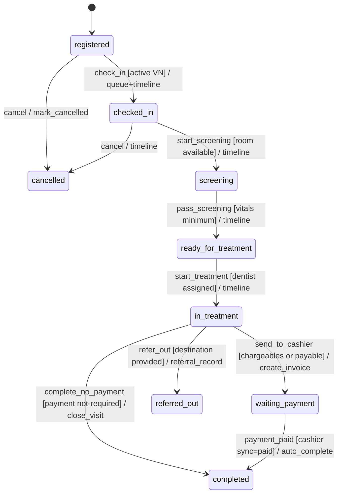
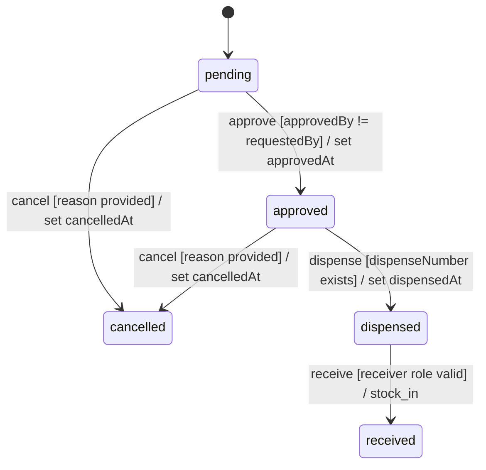
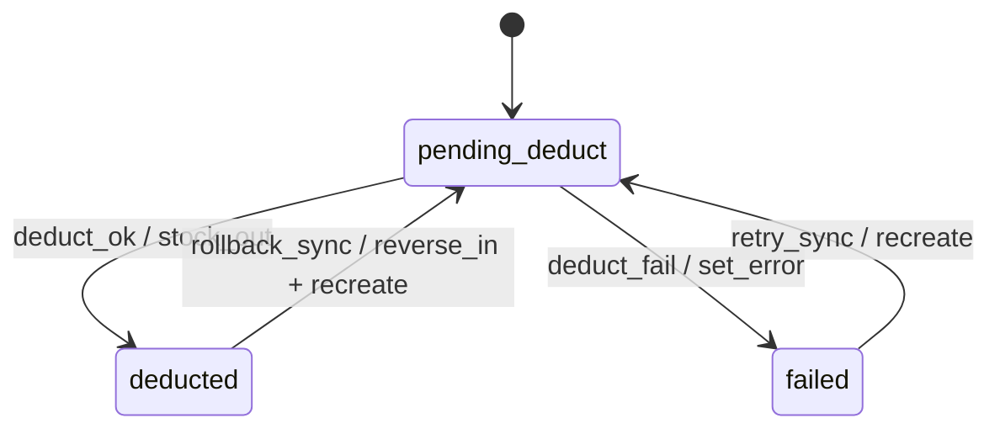

# 00 - Specifications: Dental System Full Decomposition

## Feature slug: `dental-system`

---

## Scope inputs

- Requirement source: <https://meditech-prototype.dudee-indeed.com/docs-portal/docs/dental/README>
- In-scope areas:
  - Dental master data
  - Dental workflow and queue lifecycle
  - Dental clinical forms and cumulative history
  - Supply, costing, requisition, stock, billing
  - Cross-module integration contracts
  - Authentication and authorization for dental
  - Admin backend operations for CRUD-style resources
- Out-of-scope areas:
  - Non-dental module business logic internals (Registration, Eligibility, Pharmacy, Cashier, Appointment)
  - Infrastructure provisioning details (cloud, network)
  - UI design polish beyond requirements conformance

---

## Step 0 - Framework translation pass (source is Next.js-oriented)

| Source term | Rails BFF equivalent |
|---|---|
| App Router page | `config/routes.rb` + controller action + ERB view |
| API route (`/api/*`) | Rails controller endpoint under locale-scoped route namespace |
| Server Action | Controller action + form submit + use case orchestration |
| Middleware auth check | `before_action` + Pundit policy enforcement |
| Client hook state | Stimulus controller state / Turbo frame behavior |
| SSR data loader | Controller/query object (`app/queries/*`) |
| TypeScript service layer | `app/integrations/backend/*` providers + mappers |
| In-memory mock service | Local test seam in spec support or fake provider (not runtime mode) |
| React modal form dispatch | Rails partial/form endpoints + Turbo/Stimulus modal shell |
| JSONB post store | Rails model with `jsonb`-equivalent serialized payload in SQLite (JSON text + validations) |

---

## Step 1 - Pattern matching (ambiguity resolution)

| Vague term | Concrete interpretation |
|---|---|
| "study every topic in detail" | Cover all dental documents: masterdata (5), workflow (4), clinical-forms (4), supply-and-costing (4), integration (4), plus dental README and docs root README |
| "design strictly according to docs" | Treat TOR traceability and documented FR/BR/NFR as normative contract; no feature deletion |
| "admin backend not in docs" | Provide CRUD governance/admin operations for each dental resource with policy and audit requirements |
| "if unclear but workable, mark TODO" | Add explicit `TODO:` markers in decomposition artifacts where contracts are implied but unspecified |
| "cover 100%" | Build source traceability matrix with no uncovered mandatory source items before phase decomposition |
| "ready to implement" | Artifacts include phase slicing, file scopes, guard conditions, and test mapping for request/policy/contract/system layers |

No unresolved ambiguous terms remain.

---

## Step 1.5 - Source inventory (required)

```txt
Source: dental README + 17 dental deep documents + registration workflow summaries + eligibility README
  Contains:
    [x] Entity/data model definitions (count: 36+)
    [x] Field-level specs with types/validation (count: 300+)
    [x] Form/UI component specs (count: 22 forms)
    [x] API endpoint definitions (count: 45+)
    [x] Workflow state transitions (count: 3 core state machines)
    [x] Guard conditions + error messages (count: 40+)
    [x] Permission/role definitions (count: 9 roles + 6 permission matrices)
    [x] Enum/constant definitions (count: 25+ enums/status sets)
    [x] Business algorithms/calculation rules (count: 12+)
    [x] Cross-module integration contracts (count: 8 module interfaces)
    [x] Non-functional requirements (count: 15+)
    [x] ID/number formatting patterns (count: 5)
```

Depth classification: Full.

---

## Step 2 - State machine models

### Feature A: Dental visit workflow lifecycle

```txt
Feature: Dental Visit Workflow

States:
  - Initial: registered
  - Normal: checked-in, screening, ready-for-treatment, in-treatment, waiting-payment
  - Error: transition_rejected, guard_failed, payment_sync_failed
  - Final: completed, referred-out, cancelled

Transitions:
  registered --[check-in]--> checked-in : create queue/timeline
  checked-in --[start screening]--> screening : screening form entry starts
  screening --[screening pass]--> ready-for-treatment : validate vitals minimum
  ready-for-treatment --[dentist starts]--> in-treatment : assign dentist
  in-treatment --[send cashier]--> waiting-payment : create invoice + set pending
  in-treatment --[no charge path]--> completed : paymentStatus=not-required
  waiting-payment --[payment paid]--> completed : payment sync auto-complete
  in-treatment --[refer out]--> referred-out : referral record
  registered/checked-in --[cancel]--> cancelled : stop queue participation
```



Guarded transitions:

| Transition | Guard condition | User-facing error message | Enforcement point |
|---|---|---|---|
| registered -> checked-in | Active VN exists | "No active visit found" | BFF |
| checked-in -> screening | Room available | "No examination room available" | BFF |
| screening -> ready-for-treatment | Vitals minimum present | "Please complete vital signs before continuing" | both |
| ready-for-treatment -> in-treatment | Dentist assigned | "Please assign a dentist" | both |
| in-treatment -> waiting-payment | At least one chargeable clinical post and invoice creation success | "Unable to send to payment. Missing treatment data or invoice creation failed" | BFF |
| in-treatment -> completed | paymentStatus = not-required | "This visit has payable items and must be sent to cashier" | BFF |
| waiting-payment -> completed | paymentStatus = paid | "Payment is not complete" | BFF |

### Feature B: Medication/supply requisition lifecycle

```txt
Feature: Requisition Lifecycle

States:
  - Initial: pending
  - Normal: approved, dispensed
  - Error: state_guard_violation
  - Final: received, cancelled

Transitions:
  pending --[approve]--> approved : approver metadata
  approved --[dispense]--> dispensed : dispense number required
  dispensed --[receive]--> received : create stock_in movements
  pending --[cancel]--> cancelled : capture reason
  approved --[cancel]--> cancelled : capture reason
```



### Feature C: Usage deduction lifecycle

```txt
Feature: Usage Deduction

States:
  - Initial: pending_deduct
  - Normal: deducted
  - Error: failed
  - Final: deducted, voided(rollback path)

Transitions:
  pending_deduct --[deduction success]--> deducted : stock movement out
  pending_deduct --[insufficient stock/dispatch failure]--> failed : deduct_error set
  deducted/failed --[post void/edit rollback]--> pending_deduct : reverse movement then re-sync
```



---

## Step 2.5 - Detail extraction (full depth)

### 1. Entity and field inventory (implementation home)

- Core entities:
  - `DentalProcedureGroup`, `DentalProcedureItem`, `DentalMedicationProfile`, `DentalSupplyCategory`, `DentalSupplyItem`, `DentalToothReference`, `DentalToothSurface`, `DentalToothRootReference`, `DentalToothPieceReference`, `DentalImageType`, `DentalProcedureItemCoverage`, `DentalSupplyItemCoverage`
  - Home: `app/domains/dental/master_data/*`, persistence in `app/models/*`
- Workflow entities:
  - `DentalVisitWorkflow`, `DentalWorkflowTimelineEntry`
  - Home: `app/domains/dental/workflow/*`, `app/queries/workspace/*`
- Clinical entities:
  - `DentalClinicalPost`, extracted projections (`dental_chart_records`, `dental_procedure_records`, `dental_image_records`), patient history summary
  - Home: `app/domains/dental/clinical/*`, `app/queries/dental/*`
- Transaction entities:
  - Medication/supply usage records, stock movements, medication/supply requisitions + items
  - Home: `app/domains/dental/supply_costing/*`, orchestration in `app/use_cases/*`
- Admin entities (inferred):
  - CRUD audit event, import job, admin bulk operation, approval request
  - Home: `app/domains/dental/admin/*`

### 2. API inventory (request/response + errors)

- Primary surfaces: queue, workflow, masterdata, clinical, usage, stock, requisitions.
- Rails BFF canonical endpoint shape should remain locale-scoped and UI-owned.
- Integration provider mappings stay in `app/integrations/backend/*`.
- Error code set to preserve: `NOT_FOUND`, `VALIDATION_ERROR`, `INVALID_STAGE_TRANSITION`, `STATE_GUARD_VIOLATION`, `INSUFFICIENT_STOCK`, `DUPLICATE_ENTRY`, `UNAUTHORIZED`, `FORBIDDEN`.

### 3. Permission matrix (roles -> permissions)

- Roles: DENTIST, DENTAL_ASSISTANT, DENTAL_NURSE, DENTAL_ADMIN, HEAD_DENTAL, PHARMACIST, CASHIER, REGISTRATION, SYSTEM_ADMIN.
- Enforcement split:
  - BFF: Pundit policies in `app/policies/*`
  - UI: hide controls via presenter helpers only (not source of truth)
- Required policy namespaces:
  - `Dental::MasterDataPolicy`, `Dental::WorkflowPolicy`, `Dental::ClinicalPolicy`, `Dental::StockPolicy`, `Dental::RequisitionPolicy`, `Dental::PrintPolicy`, `Dental::AdminPolicy`

### 4. Enum and i18n labels

- Major enums: visit stage, payment status, queue source/status, medication category, stock source, usage status, requisition status, image modality.
- User-facing labels must live in:
  - `config/locales/en.yml`
  - `config/locales/th.yml`

### 5. Business algorithms

- Runtime pricing resolution priority:
  1. Coverage by `(itemId, eligibilityCode)` with effective window
  2. Master price fallback (`price_opd`/`price_ipd`)
  3. Dentist override with mandatory reason log
- Copay algorithm:
  - `copayAmount` xor `copayPercent`
- Cumulative tooth map algorithm:
  - latest chart snapshot + full procedure history per tooth
- Requisition guard algorithm:
  - strict transition matrix and role/identity checks

### 6. Integration contracts

- Registration -> dental: VN/HN/eligibility baseline
- Appointment <-> dental: inbound queue sync + outbound next visit
- Eligibility -> dental: coverage inputs
- Dental -> cashier and cashier -> dental: invoice/payment sync
- Dental -> pharmacy/order dispatch for stock source `pharmacy`
- Dental requisition -> pharmacy/central stock
- Clinical queue bidirectional status sync

### 7. NFRs

- Search, queue, transition, pricing, deduction response targets from SRS (100-2000ms ranges depending on operation).
- Concurrency:
  - optimistic locking on mutable records
  - idempotent stock movements by reference uniqueness
- Integrity:
  - soft-delete on master data with transactional references
  - append-only timeline and reversible stock movement rules

### 8. UI composition specs (Rails alignment)

- Workspace requires 22 form entry points (6 dental-specific + 16 shared forms).
- Queue dashboard requires filtered list + stats cards + near-real-time refresh.
- Master data admin requires CRUD with search/select dialogs and bulk operations.
- Home:
  - `app/controllers/*` thin and policy-enforced
  - `app/views/*` declarative with helper/presenter mapping

---

## Admin backend design (inferred, mandated by request)

For each CRUD resource (procedure groups/items, medications, supplies, references, coverages, image types):

- Provide admin workflows:
  - Create/update/deactivate/reactivate
  - Bulk import/export CSV
  - Bulk activation/deactivation
  - Versioned change log and audit entries
- Governance controls:
  - Maker-checker for sensitive operations (`coverage`, `price`, `approval-required` flags)
  - HEAD_DENTAL or SYSTEM_ADMIN approval for destructive transitions
- Safety expectations:
  - Prevent hard delete when referenced by transactions
  - Validate uniqueness and external FK compatibility before save

TODO markers required by requirement ambiguity:

- TODO (DL-001): confirm central IAM source of truth for role-to-permission mapping payload format.
- TODO (DL-002): confirm whether approvals use dedicated approval service or in-module table/workflow.
- TODO (DL-006): confirm print templates legal wording and signature metadata required by regulator.
- TODO (DL-004): confirm final external identifier formats for VN/HN in production integration.

---

## Decision log (temporary but executable)

| Decision ID | Decision (temporary) | Applies to | Why now | Fallback behavior | Exit criteria | Owner | Target date |
|---|---|---|---|---|---|---|---|
| DL-001 | Use deny-by-default permission posture and only explicitly grant documented actions. | All policy-protected dental endpoints. | Role contract details can drift; safest executable default is least privilege. | Return forbidden and log audit event; no hidden auto-allow rules. | Final IAM permission contract approved and policy matrix signed off. | BFF + Security | 2026-04-30 |
| DL-002 | Use in-module approval workflow tables for maker-checker actions behind use-case interface. | Coverage/price sensitive admin operations and requisition approvals. | Approval service contract is unknown; work must continue now. | Keep interface stable so external approval service can replace adapter later. | Central approval service contract finalized and integration tests pass. | BFF + Admin | 2026-05-15 |
| DL-003 | Standardize payment sync auth as signed header secret + idempotency key. | Cashier callback and polling sync update paths. | Callback auth mechanism unspecified; need secure default. | If callback verification fails, ignore payload and keep polling path active. | Cashier team publishes canonical callback auth and replay policy. | BFF + Cashier | 2026-04-25 |
| DL-004 | Enforce row-level access at BFF policy/query layer for SQLite runtime. | Clinical post/history access and audit visibility restrictions. | PostgreSQL RLS patterns are documented but runtime DB is SQLite. | Introduce DB-native RLS only if production DB migrates and parity tests pass. | Architecture decision confirms DB-native RLS requirement and platform support. | BFF + Platform | 2026-05-31 |
| DL-005 | Implement queue refresh with polling (30s) as baseline transport. | Daily queue dashboard and waiting-payment monitor surfaces. | Real-time transport (websocket) is not contractually fixed. | Optional websocket can be added behind feature flag without contract change. | Performance and UX test confirms websocket requirement beyond polling SLA. | BFF + Frontend | 2026-05-10 |
| DL-006 | Print templates start from internal bilingual templates with legal placeholder blocks. | Appointment, certificate, treatment summary, dental chart printouts. | Official legal template package not yet provided. | Mark print output as provisional and prevent production legal release flag. | Legal/central authority approves final template, signature, and stamp rules. | Product + Legal + BFF | 2026-05-31 |

Decision usage rule:

- Every unresolved TODO must map to a Decision ID above before implementation starts.
- If a decision changes, update this table and linked phase decision logs in the same PR.

### TODO index (single tracking table)

Status legend:

- `Open`: not started yet, owner assigned.
- `In progress`: actively being worked on.
- `Blocked`: cannot proceed due to dependency/decision outside current owner control.
- `Resolved`: requirement clarified and action completed.
- `Deferred`: intentionally postponed with explicit reason and next review date.

| TODO ID | TODO summary | File | Decision ID | Owner | Due date | Status | Last updated |
|---|---|---|---|---|---|---|---|
| T-001 | Confirm IAM source of truth for role-permission payload. | `docs/tasks/dental-system/00-specifications.md` | DL-001 | BFF + Security | 2026-04-30 | Open | 2026-04-10 |
| T-002 | Confirm approval architecture (external service vs in-module). | `docs/tasks/dental-system/00-specifications.md` | DL-002 | BFF + Admin | 2026-05-15 | Open | 2026-04-10 |
| T-003 | Confirm legal wording/signature metadata for print templates. | `docs/tasks/dental-system/00-specifications.md` | DL-006 | Product + Legal + BFF | 2026-05-31 | Open | 2026-04-10 |
| T-004 | Confirm final external VN/HN identifier format contract. | `docs/tasks/dental-system/00-specifications.md` | DL-004 | BFF + Platform | 2026-05-31 | Open | 2026-04-10 |
| T-005 | Confirm invoice/payment callback payload identifier types. | `docs/tasks/dental-system/phase-01-foundation.md` | P01-DL-001 | BFF + Integration | 2026-04-25 | Open | 2026-04-10 |
| T-006 | Confirm stock reference ID type across external modules. | `docs/tasks/dental-system/phase-01-foundation.md` | P01-DL-001 | BFF + Integration | 2026-04-25 | Open | 2026-04-10 |
| T-007 | Confirm final approval role boundaries for price/requireApproval fields. | `docs/tasks/dental-system/phase-02-master-data-and-admin.md` | P02-DL-001 | Product + Admin | 2026-05-15 | Open | 2026-04-10 |
| T-008 | Confirm denormalized field sync cadence for drug/charge data. | `docs/tasks/dental-system/phase-02-master-data-and-admin.md` | P02-DL-002 | BFF + Admin | 2026-05-15 | Open | 2026-04-10 |
| T-009 | Confirm queue refresh transport strategy for production. | `docs/tasks/dental-system/phase-03-workflow-and-queue.md` | P03-DL-001 | BFF + Frontend | 2026-05-10 | Open | 2026-04-10 |
| T-010 | Confirm authoritative room-allocation source and fallback. | `docs/tasks/dental-system/phase-03-workflow-and-queue.md` | P03-DL-002 | BFF + Ops | 2026-05-10 | Open | 2026-04-10 |
| T-011 | Confirm clinical image backend for retention compliance. | `docs/tasks/dental-system/phase-04-clinical-forms-and-history.md` | P04-DL-001 | BFF + Platform + Legal | 2026-05-31 | Open | 2026-04-10 |
| T-012 | Confirm DICOM viewer and MIME normalization policy. | `docs/tasks/dental-system/phase-04-clinical-forms-and-history.md` | P04-DL-001 | BFF + Clinical IT | 2026-05-31 | Open | 2026-04-10 |
| T-013 | Confirm callback/webhook authentication standard for payment sync. | `docs/tasks/dental-system/phase-05-supply-costing-and-billing.md` | P05-DL-001 | BFF + Cashier | 2026-04-25 | Open | 2026-04-10 |
| T-014 | Confirm invoice cancellation behavior after partial payment. | `docs/tasks/dental-system/phase-05-supply-costing-and-billing.md` | P05-DL-003 | BFF + Cashier + Finance | 2026-04-30 | Open | 2026-04-10 |
| T-015 | Confirm canonical JWT claim names and permissions payload requirements. | `docs/tasks/dental-system/phase-06-integration-authz-and-audit.md` | P06-DL-002 | Security + IAM | 2026-04-30 | Open | 2026-04-10 |
| T-016 | Confirm final RLS strategy for SQLite runtime constraints. | `docs/tasks/dental-system/phase-06-integration-authz-and-audit.md` | P06-DL-001 | Platform + Security | 2026-05-31 | Open | 2026-04-10 |
| T-017 | Confirm official print form numbers/signature/stamp requirements. | `docs/tasks/dental-system/phase-07-printing-and-release-hardening.md` | P07-DL-001 | Legal + Product | 2026-05-31 | Open | 2026-04-10 |
| T-018 | Confirm archival retention and watermark obligations for print/PDF. | `docs/tasks/dental-system/phase-07-printing-and-release-hardening.md` | P07-DL-001 | Legal + Compliance | 2026-05-31 | Open | 2026-04-10 |

---

## Step 4.5 - Completeness verification (source traceability matrix)

| Source item | Category | Covered by scenario? | Covered by extraction? | Output location |
|---|---|---|---|---|
| dental/README | Overview + architecture | Yes | Yes | this file + `01-overview.md` |
| masterdata/01-SRS | Functional + NFR + TOR | Yes | Yes | this file + phase 02 |
| masterdata/02-DATA-DICTIONARY | fields/validations | Yes | Yes | this file + phase 02 |
| masterdata/03-DATABASE-SCHEMA | schema/index/constraints | Yes | Yes | this file + phase 02 |
| masterdata/04-ER-DIAGRAM | relations/dependencies | Yes | Yes | this file + phase 02 |
| masterdata/05-COVERAGE-PRICING | pricing/coplay/rules | Yes | Yes | this file + phases 02/05 |
| workflow/01-SRS | 9-stage lifecycle | Yes | Yes | this file + phase 03 |
| workflow/02-DATA-DICTIONARY | workflow fields/enums | Yes | Yes | this file + phase 03 |
| workflow/03-DATABASE-SCHEMA | triggers/guards/timeline | Yes | Yes | this file + phase 03 |
| workflow/04-DFD | queue/payment flow | Yes | Yes | this file + phase 03 |
| clinical-forms/01-SRS | 22 forms + BR-CF | Yes | Yes | this file + phase 04 |
| clinical-forms/02-DATA-DICTIONARY | JSON schemas + tooth history | Yes | Yes | this file + phase 04 |
| clinical-forms/03-DATABASE-SCHEMA | posts/projections/views | Yes | Yes | this file + phase 04 |
| clinical-forms/04-DFD | save/dispatch/allergy flow | Yes | Yes | this file + phase 04 |
| supply-and-costing/01-SRS | usage/stock/requisition/billing | Yes | Yes | this file + phase 05 |
| supply-and-costing/02-DATA-DICTIONARY | transaction fields | Yes | Yes | this file + phase 05 |
| supply-and-costing/03-DATABASE-SCHEMA | movement/requisition guards | Yes | Yes | this file + phase 05 |
| supply-and-costing/04-DFD | end-to-end transaction flow | Yes | Yes | this file + phase 05 |
| integration/01-CROSS-MODULE-INTEGRATION | module contracts | Yes | Yes | this file + phase 06 |
| integration/02-API-DESIGN | endpoint contracts + errors | Yes | Yes | this file + phase 06 |
| integration/03-TOR-TRACEABILITY | TOR coverage baseline | Yes | Yes | this file + `test-scenarios.md` |
| integration/04-AUTH-AND-PERMISSIONS | roles/policies/RLS/audit | Yes | Yes | this file + phase 06 |
| docs/README | cross-module references | Yes | Yes | this file + phase 06 |
| registration workflow docs | intake/identity assumptions | Yes | Yes | this file + phase 03/06 |
| eligibility README | eligibility code governance | Yes | Yes | this file + phases 02/05 |

All mandatory source categories are covered.
